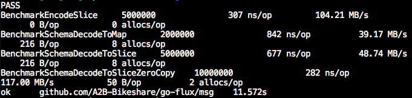

[](https://waffle.io/a2b-bikeshare/go-flux)
Flux for Go [](https://godoc.org/github.com/A2B-Bikeshare/go-flux)
=====================
Write *all the messages*.
Powered by [NSQ](http://nsq.io/) and a custom dialect of [MessagePack](http://msgpack.org).

Intro
-------------
Note: Fluxlog is currently under *heavy* development. The API is unstable and some of the functionality is a little rough around the edges.

Flux is designed to deliver small messages across your infrastructure quickly and reliably. The fact that flux is built
around NSQ means that messages have much more durability than they would otherwise. Additionally, flux ships with a special serializer
that significantly reduces encoding/decoding overhead and overall message size. Flux is great for telemetry data and streaming logs, or
any other data that doesn't need write immediacy. (Flux and NSQ trade immediacy/latency for throughput and durability.)

Flux has three parts:
  - flux/msg contains the encode/decode API for flux messages
  - flux/log contains the API for writing flux messages to an [NSQ](http://nsq.io) daemon
  - flux/fluxd contains the API for reading flux messages from an [NSQ](http://nsq.io) topic and writing them to a supported database.

Currently, I have plans to implement streaming JSON encoders to turn flux messages into [Elasticsearch](http://elasticsearch.org)- and [InfluxDB](http://influxdb.com)-compatible JSON.
We're looking for contributor for other database bindings. (MongoDB, RethinkDB, Neo4j, Riak...)

Note that flux/log and flux/fluxd do not *require* you to use flux/msg encoding. However, the library's built-in DB
interfaces are designed for flux/msg encoding, so you would have to roll your own.

Quick Start
-----------
Let's examine the contents of these two files, located in the /cmd subdirectory:

/cmd/demo/client/client.go
```go
package main

import (
  "fmt"
  "github.com/A2B-Bikeshare/go-flux/log"
  "github.com/A2B-Bikeshare/go-flux/msg"
)

// This is structure of the message we are sending
type Tele struct {
  Name string
  Dir  string
  Val  float64
  Uid  uint64
  Chrg int64
}

// Encode fulfills the msg.Encoder interface;
// this defines how the message should be encoded
// on the wire.
func (t *Tele) Encode(w msg.Writer) error {
  msg.WriteString(w, t.Name)
  msg.WriteString(w, t.Dir)
  msg.WriteFloat64(w, t.Val)
  msg.WriteUint(w, t.Uid)
  msg.WriteInt(w, t.Chrg)
  return nil
}

func main() {
  // create a new logger instance writing to "demotopic" on the local nsqd instance
  fluxl, err := log.NewLogger("demotopic", ":4150", "")
  if err != nil {
    panic(err)
  }

  // create a new Tele object
  newtele := &Tele{"ERROR", "/bin", 1.388, 67890, -1}

  // send it NSQ
  fluxl.Send(newtele)

  // close
  fluxl.Close()
  fmt.Println("Message sent.")
}
```

/cmd/demo/server/server.go
```go
package main

import (
  "fmt"
  "github.com/A2B-Bikeshare/go-flux/fluxd"
  "github.com/A2B-Bikeshare/go-flux/msg"
)

// This schema defines how we decode the Tele
// object. We could have used a Schema object
// on the client side instead of a struct,
// if we wanted to.
var TeleSchema = msg.Schema{
  {Name: "name", T: msg.String},
  {Name: "dir", T: msg.String},
  {Name: "val", T: msg.Float},
  {Name: "uid", T: msg.Uint},
  {Name: "chrg", T: msg.Int},
}

// This binding tells the server
// how to decode messages and write them
// to a database. In this case, we're
// using the built-in batching InfluxDB
// writer.
var TeleBinding = &fluxd.BatchBinding{
  Topic:   "demotopic",
  Channel: "demo_recv",
  Endpoint: &fluxd.InfluxDB{
    Schema: TeleSchema,
    Addr:   "localhost:8083",
    DBname: "test",
  },
}

func main() {
  // This creates our server, which polls for
  // topics from the nsqdlookupd(s) running
  // at the address(es) supplied. The 'UseStdout'
  // option bypasses http requests to the database
  // and instead formats the requests and writes them to
  // standard out.
  srv := &fluxd.Server{
    Lookupdaddrs: []string{"127.0.0.1:4161"},
    UseStdout:    true,
  }

  // Bind out binding
  srv.BindBatch(TeleBinding)
  fmt.Println("Initializing server...")

  // Run the server
  err := srv.Run()
  if err != nil {
    fmt.Println(err)
  }
}
```

To run this example, first open up a shell window and start an nsqlookupd:
```
$> nsqlookupd
```
Then, in another window, start up nsqd pointed to the nsqlookupd:
```
$> nsq --lookupd-tcp-address=127.0.0.1:4160
```
Then, in yet another terminal, have the client send a message:
```
$> go run $GOPATH/src/github.com/A2B-Bikeshare/go-flux/cmd/demo/client/client.go
...
"Message sent."
```
And then, finally, have the server receive the message:
```
$> go run $GOPATH/src/github.com/A2B-Bikeshare/go-flux/cmd/demo/server/server.go
...
--------- SERVER REQUEST ---------
Method: POST
Address: localhost:8083/db/test/series?u=root&p=root
Body:
[{"name":"ERROR","columns":["dir","val","uid","chrg"],"points":[["/bin",1.388,67890,-1]]}]
----------------------------------
```

Notice that the client and server don't have to be running at the same time. We could have started the server
and then started the client, and we would have achieved the same result. You can have the client send
hundreds of requests at a time, and the server will batch them up and upload them as they are received.

Performance
-------------
First things first: flux/msg is designed for small messages, and serves as a substitute for compression provided that your messages are indeed small. One of the ways
flux/msg achieves small encoded sizes is by stripping keys out of your data, so, in the case that keys are a non-trivial part of your message size, you can
save quite a bit of space over the wire. Encode/Decode methods are optimized for small data members (size <= 32B) as a consequence.
If you have big messages (and small keys), the only real advantage flux/msg has is the lack of type reflection overhead. (Additionally, schemas
have shortcut methods for marshaling messages to JSON, which can be highly performant in the case that you need to communicate with your database, etc. in JSON.)

Fluxlog's encode/decode performance comes from a couple different design decisions:
  - "Messages" are statically-typed orderings of data.
  - Type reflection is done *once* per message 'type', rather than at every call to Decode(). A message 'type' is called a Schema.
  - Since schemas contain the data keys, the keys themselves are not serialized.
  - Values are packed on writing (e.g. int64(5) is encoded as an int8, and then decoded back to an int64)

Here's how long it takes to encode a message containing a string, int64, uint64, float64, and 3 arbitrary bytes (MacBook, Intel Core i7; GOMAXPROCS=1), and also
the decoding time for two different decoding methods:



Note that the sum of the sizes of the message values is 50 bytes, and the data is 32 bytes after encoding. The data rate above is calculated from the encoded size (32B).
Much of the decoding speed is derived from pre-emptively creating arrays on the stack that can be used by the encoded data. (In other words, stack space is occasionally
wasted to save heap allocations.)

TL;DR you can saturate your Gigabit connection if you want to.
